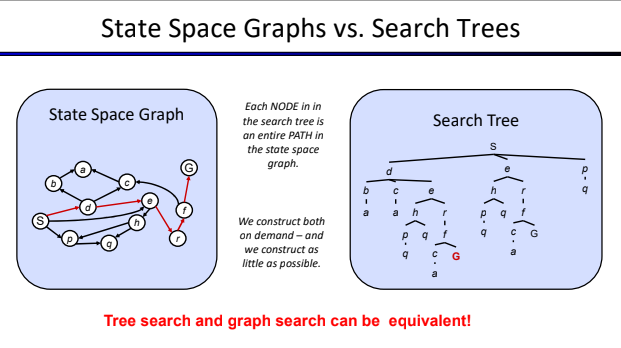

# Uninformed Search

## Agents that Plan

### Reflex Agent
- Choose action based on current percept (and memory)
- May have memory or a model of the world's current state
- So not consider the future consequences of their actions (do not plan ahead or re-plan)

Can a reflex agent be rational?
> 

### Planing Agents
- Decisions based on (hypothesized) consequences of actions
- Must have a complete model of how the world evolves in response to actions
- Must formulate a goal

Optimal vs. Complete planning
> Maximizing the utility function, time spent

##  Search Problems
Search algorithms can exhibit intelligence

1. Represent a real-world problem as a search problem
2. Design (general) search algorithms to solve it

A (generic) search problem consists of:
- a state space
- a successor function (with actions, costs)
- a start state and a goal state

A solution is a sequence of actions (a plan) which transforms the start state to a goal state (with min cost)

## State Space
The world state includes every last detail of the environment. A search state keeps only the details needed for planning (abstraction)

### State Space Graphs

- State space graph: A mathematical representation of a search problem
    - Nodes are (abstracted) world configurations
    - Arcs represent successors (action results)
    - The goal test is a set of goal nodes (maybe only one)
- In a state space graph, each state occurs only once
- We can rarely build this full graph in memory (it's too big), but it's a useful idea

#### Search Trees
- A “what if” tree of plans and their outcomes 
- The start state is the root node
- Children correspond to successors 
- Nodes show states, but correspond to PLANS that achieve

